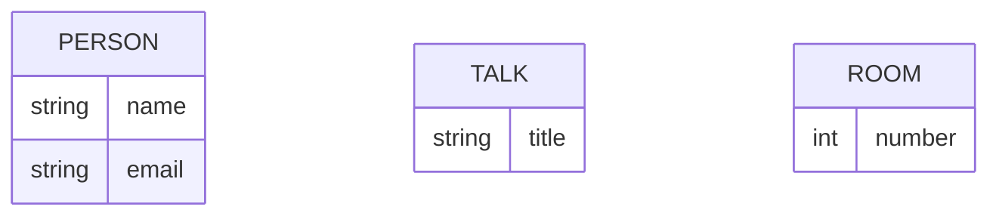
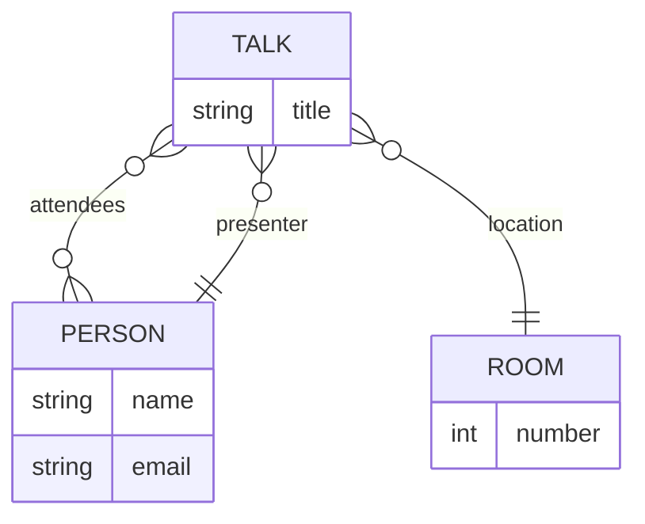

# Entity Relationship Diagram

Mermaid Entity Relationship Diagram for modeling data or models.
Often used to describe relational databases.

## Entities and Attributes

## Relationships

Cardinality:

* `|o`: Zero or one
* `||`: Exactly one
* `}o`: Zero or more
* `}|`: One or more
