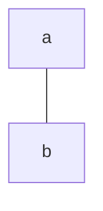
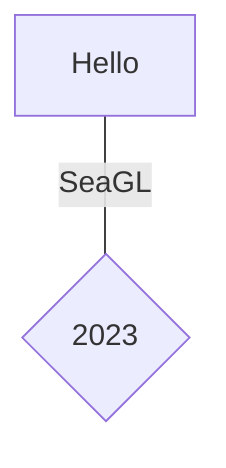
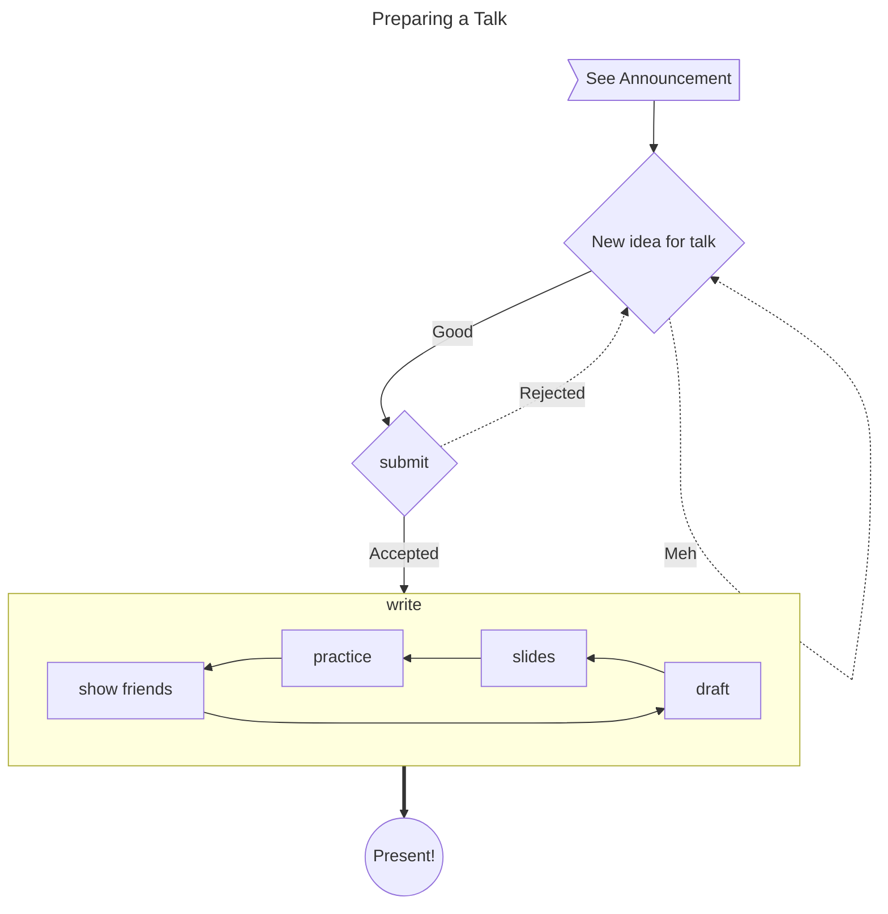

# Flowchart Examples

## Basic Syntax

### Directions:

* TD / TB (default)
* BT
* RL
* LR

### Edges:

* `---`: solid
* `===`: thick
* `-.-`: dotted

Length: `----` ....

#### Arrows

* `-->`: Single arrow
* `<-->`: Double arrow

## Labels and Shapes

Shapes:

* `[]`: Box
* `{}`: Diamond
* `(())`: Circle
* `[()]`: Database
* `>]`: Flag

## Full Example

