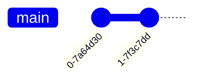
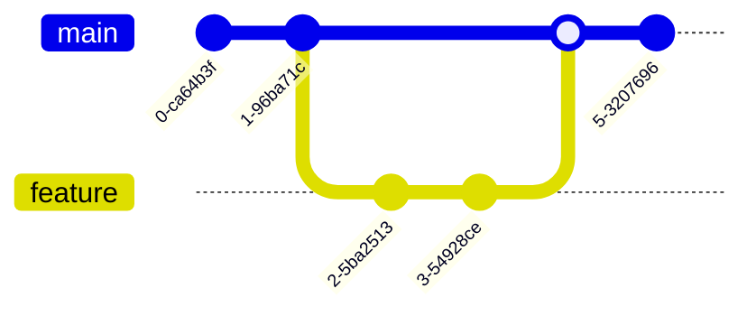
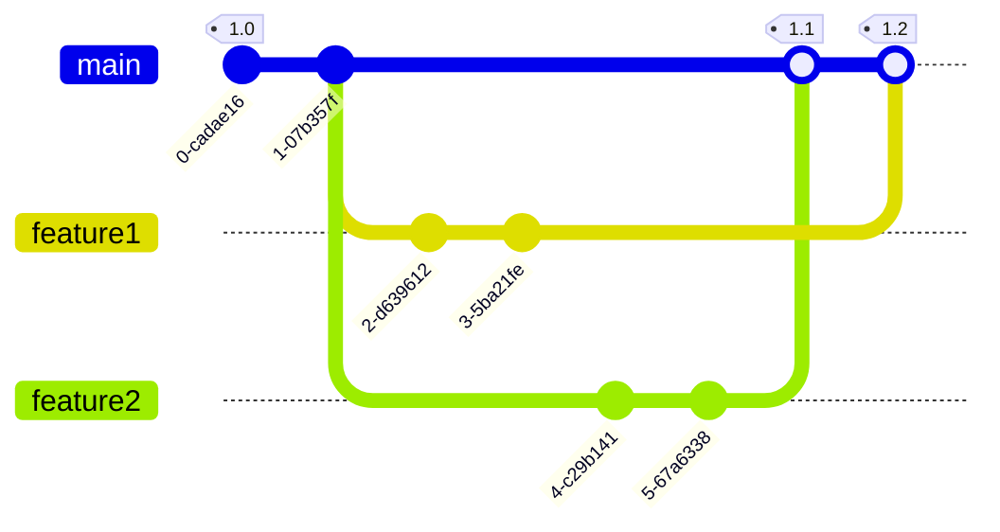

# gitgraph Diagrams

Mermaid diagrams to document git usage.

## Basic

```mermaid
gitGraph
    commit
    commit
```

## Branches

```mermaid
gitGraph
    commit
    commit
    branch feature
    commit
    commit
    checkout main
    merge feature
    commit
```

## Release Flow

```mermaid
gitGraph
    commit tag: "1.0"
    commit
    branch feature1
    commit
    commit
    checkout main
    branch feature2
    commit
    commit
    checkout main
    merge feature2 tag: "1.1"
    merge feature1 tag: "1.2"
```