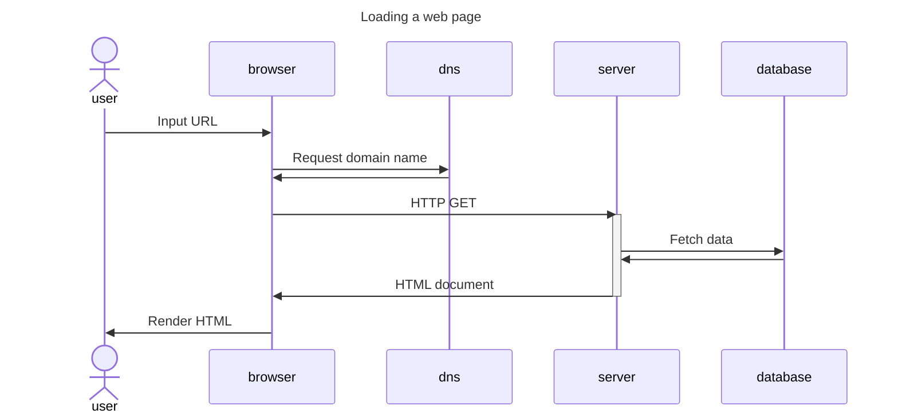

# Sequence Diagram

A Mermaid diagram showing a sequence of events.

```mermaid
---
title: Loading a web page
---
sequenceDiagram
    actor user
    participant browser
    participant dns
    participant server
    participant database

    user ->> browser: Input URL
    browser ->> dns: Request domain name
    dns ->> browser: 
    browser ->> server: HTTP GET

    activate server

    server ->> database: Fetch data
    database ->> server: 
    server ->> browser: HTML document

    deactivate server 

    browser ->> user: Render HTML
```